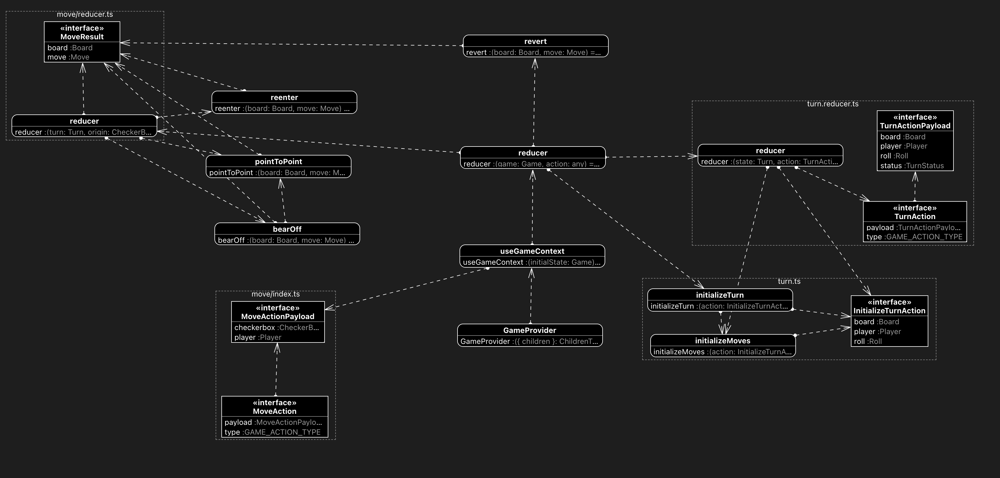

# Nodots Backgammon

Nodots Backgammon is a React implementation of the oldest boardgame in the world.

## Goals

- Professional
  - Stable (99.999% uptime)
  - Trustworthy (auditable dice and computer moves)
- Open
  - Game API that any AI engine can use

## Game Model

