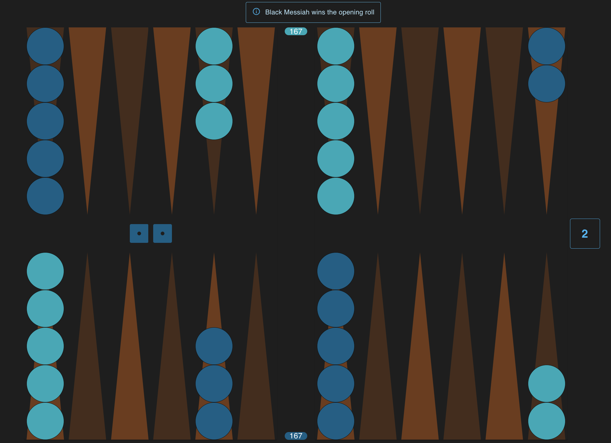
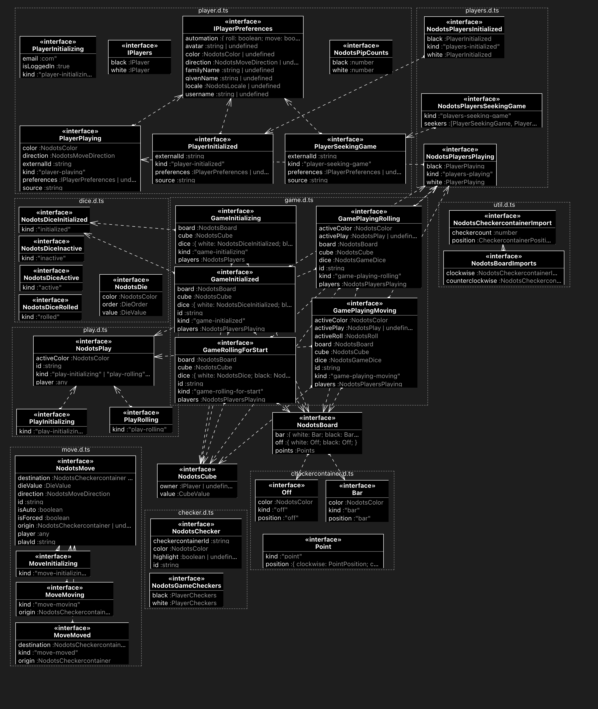

# Nodots Backgammon

Nodots Backgammon is a React implementation of the oldest boardgame in the world.

## Target Audience

Serious hobbyists anywhere in the world who want to up their game.

### Languages

- English
- Spanish
- French
- Arabic
- Turkish
- Greek

## Tech Requirements

- Integrate with BG Web API
- Playable on an iPhone

## UX/Features

- Board optimized for online play
  - e.g., no reason to have two off positions
  - Default colors are low eye-strain
- Choice of pausable drills/robot games while waiting for opponent

## API

Nodots Backgammon is a React implementation of the oldest boardgame in the world.

## Target Audience

Serious hobbyists anywhere in the world who want to up their game.

### Languages

- English
- Spanish
- French
- Arabic
- Turkish
- Greek

## UX/Features

- Board optimized for online play
  - e.g., no reason to have two off positions
  - Default colors are low eye-strain
- Choice of pausable drills/robot games while waiting for opponent

## API

[Related API project](https://github.com/nodots/nodots-backgammon-api)

## Screen Shot

## Game Model

